# model-as-a-service
This repository provides an step by step guide to build build a 'Model as a Service' based on Red Hat products, *3scale* and *Single Sign On*. It is an extension of the work presented in [model-aas](https://github.com/rh-aiservices-bu/models-aas) with more detailed instructions.

At the end  offer your users a portal through which they can register and get access keys to the models' endpoints.

Although not a reference architecture (there are many ways to implement this type of solution), this can serve as starting point to create such a service in your environment.

Further implementation could feature quotas, rate limits, different plans, billing,...

## Architecture Overview


## Screenshots

Portal:


Services:


Service detail:


Statistics:


## Deployment - Red Hat 3Scale
These deployments are working on an OpenShift AI intance on the RedHat demo platform.

### Requirements
Red Hat 3Scale uses a *system storage* with RWX volume which can be provided by *Openshfit Data Foundation*.

### Instructions
- Create a project (e.g. ***3scale***) on openshift
- Create a secret using files in "[deployment/3scale/llm_metrics_policy](./deployment/3scale/llm_metrics_policy/)"

```sh
oc create secret generic llm-metrics \
    -n 3scale \
    --from-file=./apicast-policy.json \
    --from-file=./custom_metrics.lua \
    --from-file=./init.lua \
    --from-file=./llm.lua \
    --from-file=./portal_client.lua \
    --from-file=./response.lua \
    && oc label secret llm-metrics apimanager.apps.3scale.net/watched-by=apimanager
```

Hinweis: These files are copied from [APIcast LLM Metrics Policy](https://github.com/rh-aiservices-bu/models-aas/tree/main/deployment/3scale/llm_metrics_policy#apicast-llm-metrics-policy)

- Deploy the Red Hat Integration-3scale operator in the ***3scale*** namespace only!

- Go to the installed operator page and create a Custom Policy Definition instance using [deployment/3scale/llm-metrics-policy.yaml](./deployment/3scale/llm-metrics-policy.yaml). 
    - **Attention:** Namespace should be the same as the one where the 3scale operator is installed.
    
- In the same page, go to the tab ***"API Manager"*** and create an instance using [deployment/3scale/apimanager.yaml](./deployment/3scale/apimanager.yaml). 
    - **Attention 1:** Namespace should be the same as the one where the 3scale operator is installed.
    - **Attention 2:** The attribute ***wildcardDomain*** contains the main domain for the cluster, where *3scale* is deployed. 
    For example, if I deploy my *3scale* instance in a cluster with *URL: https://console-openshift-console.apps.cluster-abc.abc.sandbox123.opentlc.com*, then the variable should be set as *wildcardDomain: apps.cluster-abc.abc.sandbox123.opentlc.com*

- It takes some minutes till all the Deployments (15) are finished successfully. 

- Go to the *routes* on your cluster and find the one that starts with *https://maas-admin ...*.

- Open the link and log in with credentials stored in in the secret *system-seed* (ADMIN_USER and ADMIN_PASSWORD). 

- Close the widget page and go to the *"Account Settings"* to set the *"Organization Name"* and your *"Timezone"*. 
For example, I set the name to *"MaaS on RHOAI"* and time to *"Berlin"*. 


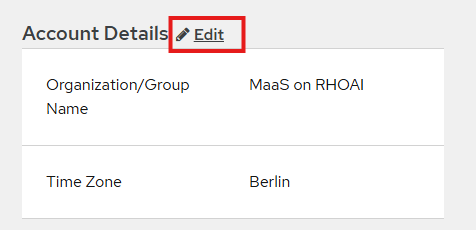

*"Organization Name"* appears at the top left corner of the main page.
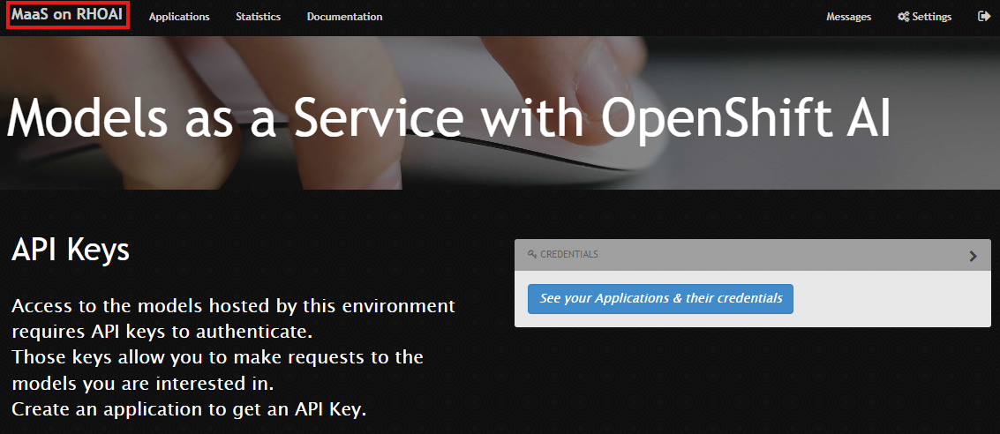

#### Backends - Provided Model Enpoints 
- We now add a backend with the corresponding *"API-Endpoint"* provided by the model server:
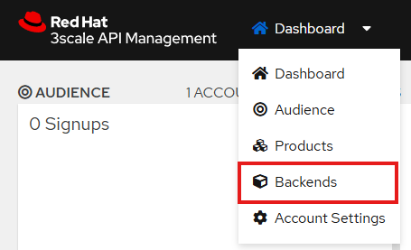
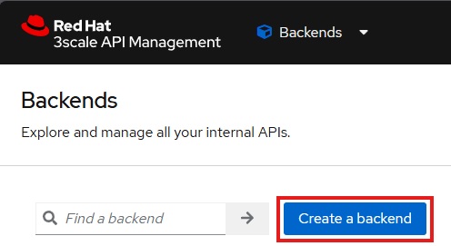

Set the *Endpoint-URL*, a display and a system name for your model, as well as a description about the model. 
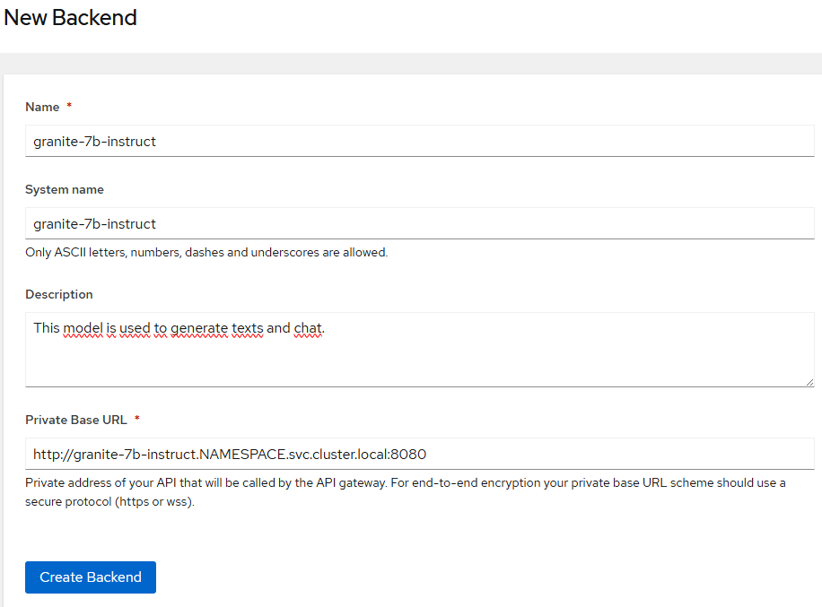

When created, you will see that the backend is now added to the list.
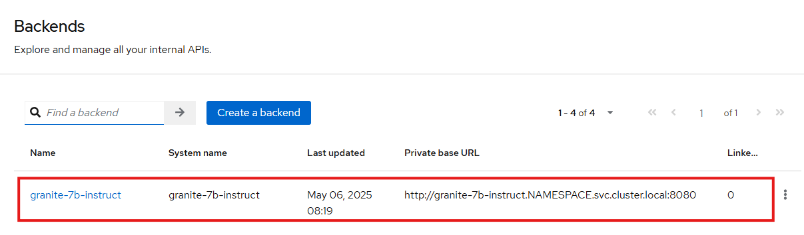

***If you have more model deployed, add them here using the same process.***


#### Products - APIs for Customers
- Go to the *"Products"* section and click on *"create a Product"*:
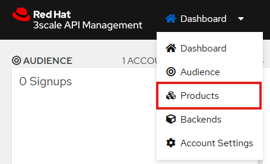
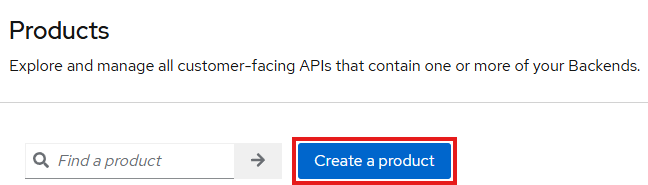

Give the product a display and a system name, as well as a description about the product.
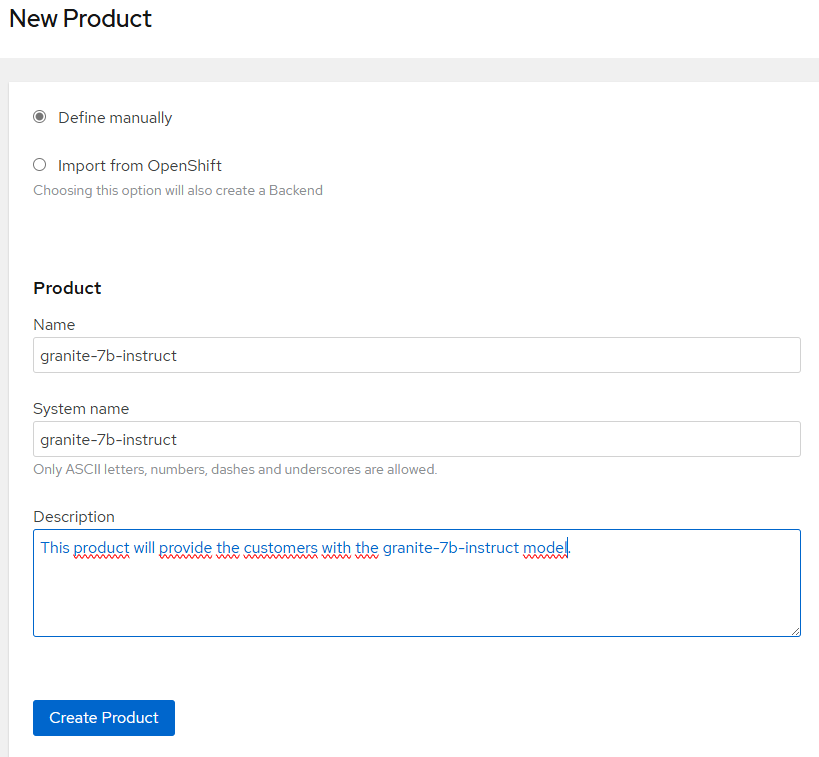

The created product is now added to the list.
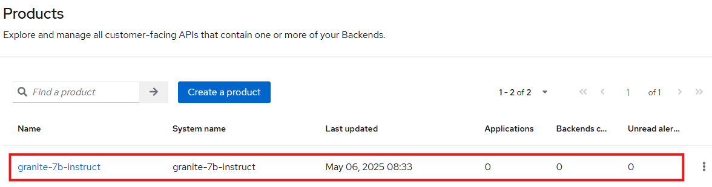

We now configure a backend for the product. 
- Click on the product's name and go to the *"integration/Backends"* from the left menu
  Add a backend by selecting the recently created backend and add it to the product:
  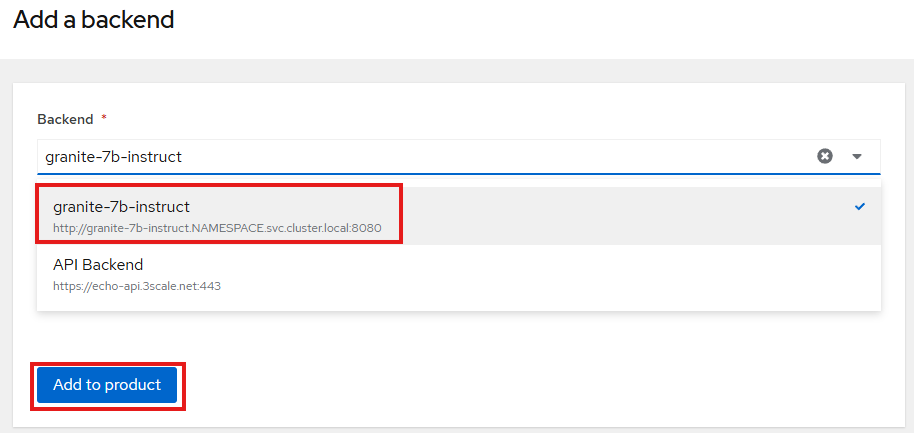

- Under the *"integration/Methods and Metrics"*, we add a method (e.g. *"List Models"*):
  
  

- Then we go to *"integration/Mapping Rules"*, and define available api-endpoints (*"Patterns"*) for that model:
  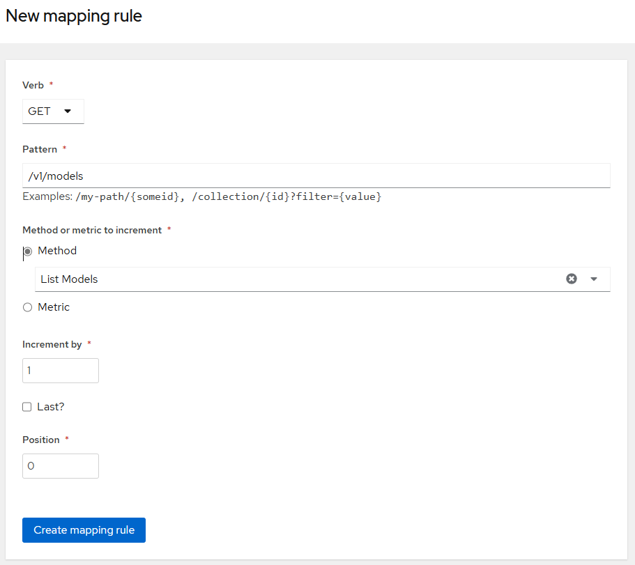
  
- We follow the same steps to add 3 more *"Methods"* and *"Mapping Rules"*:
  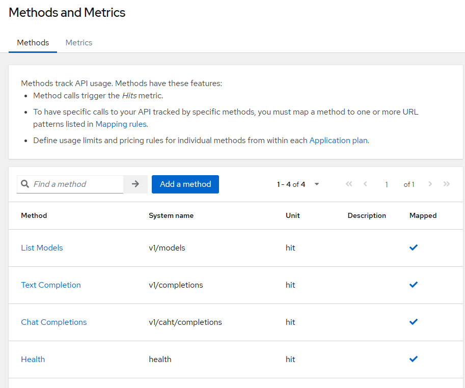
  
  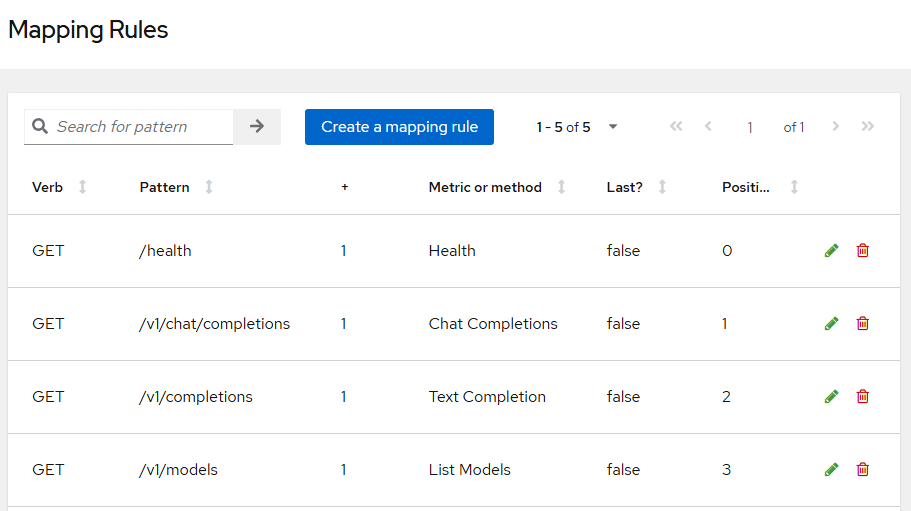


- At this step we change the authentication method for using the products. Go to *"integration/Settings"*. Change the *"Auth user key"* field content to **Authorization** and the *"Credentials location"* field to **As HTTP Basic Authentication**. When finished, click on Update product at the bottom of the page to save the changes:
  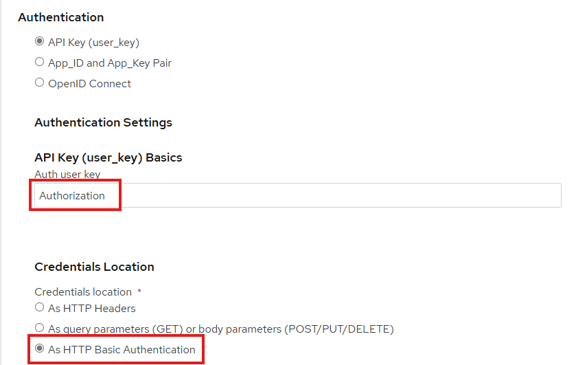