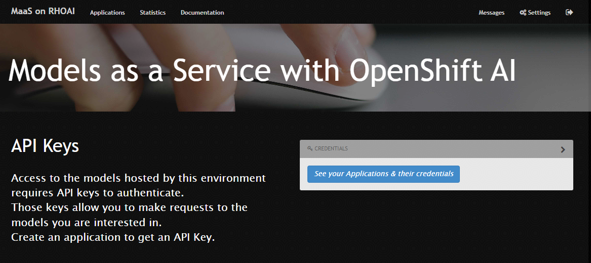
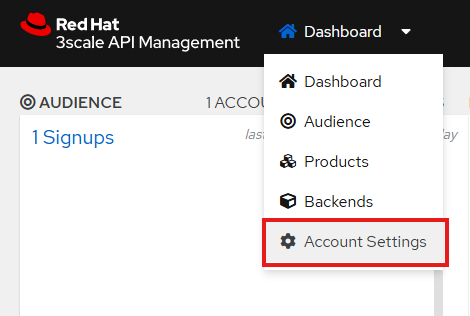
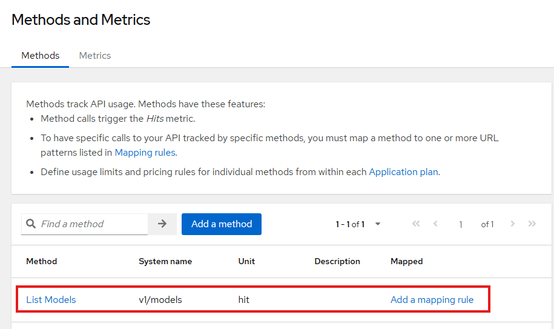
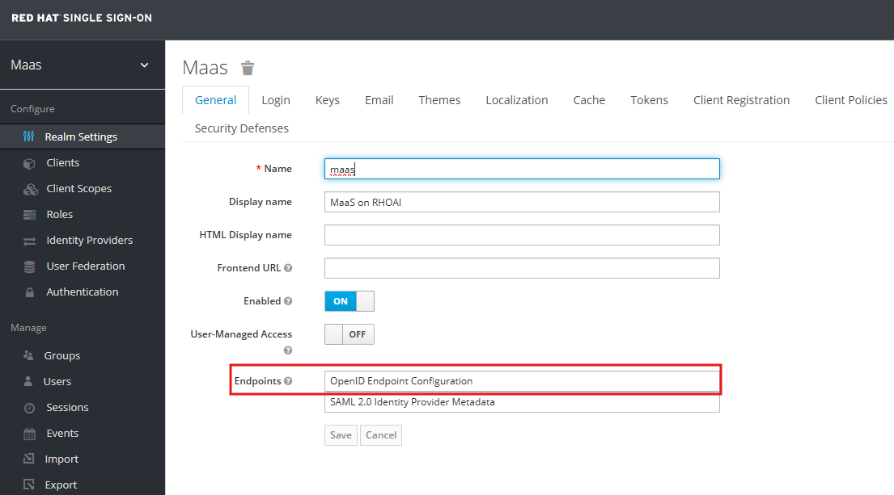
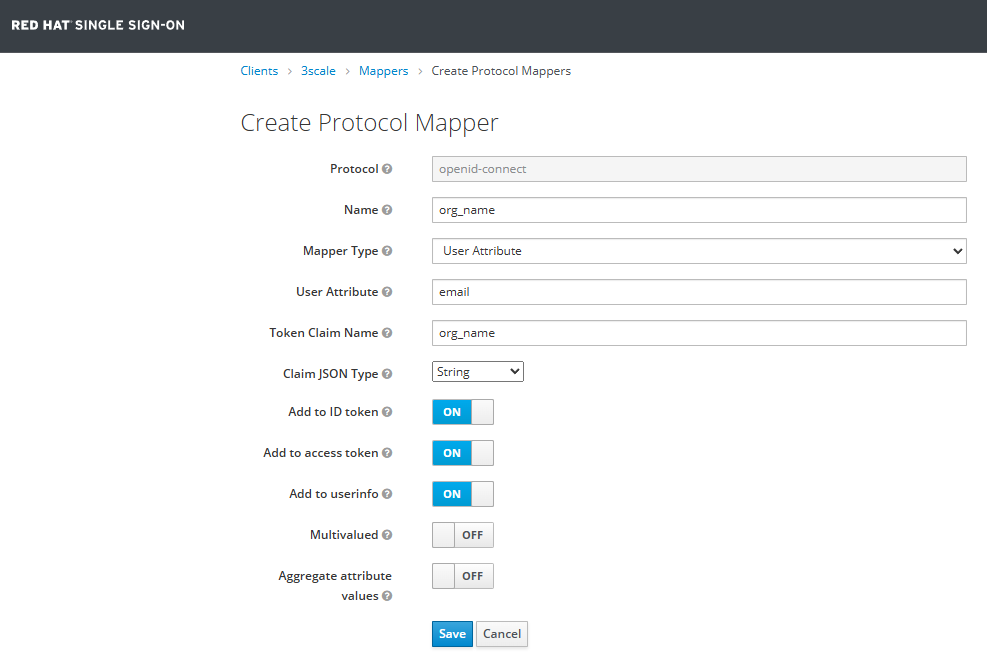

# model-as-a-service
This repository provides a step by step guide to building a 'Model as a Service' based on Red Hat products, *Openshift AI*, *3scale* and *Single Sign-On (SSO)*. It is an extension of the work presented in [model-aas](https://github.com/rh-aiservices-bu/models-aas) with more detailed instructions.

**Purpose of the Project**  
This project is a walk-through for users to access deployed models on for example *Openshift AI* via a web portal, where they can sign up, get API keys, and interact with the provided models as backend products. It works very similar to how commercial APIs like OpenAI or Google Cloud operate.

A user logs into the Developer Portal via SSO and creates an application, which automatically generates a model endpoint and API key. They use this key to send requests to the model, with 3scale validating access and monitoring usage. The model then returns predictions or results based on the requests.

**Technologies Used**:  
  * **OpenShift AI** – to deploy your model
  * **3scale API Management** – to control, track, and limit access
  * **Single Sign-On (SSO)** – to manage secure user logins
 
 **Core Components**  
 This project is made up of *four* main components that work together to deliver your Machine Learning Model as a Service.
1. **Developer Portal**  
  - Web interface for users to:
    - Sign up / Log in
    - Discover available APIs
    - Get access credentials (API keys)
  -  Think of it as a dashboard for developers.
2. **API Management with 3scale**
  - Controls who can access your model
  - Tracks usage (analytics)
  - Enforces quotas, rate limits, and subscription plans
  - Acts as the gatekeeper for your API
3. **Single Sign-On (SSO)**
  - Provides secure login via one authentication system
  - Enables seamless access across services
  - Tools like Keycloak or Red Hat SSO are commonly used
4. **Machine Learning Model as a Service**
  - Your model is deployed in the cloud (e.g., on OpenShift)
  - It receives input via API calls and returns predictions


## Architecture Overview


The diagram above illustrates how all the parts of the MaaS architecture interact, from the user sending a request to the model delivering a response, using *3scale* and *OpenShift AI*. At a high level, this setup connects a client application to a machine learning model via a secure, managed API pathway. 

Here’s how each part contributes:

The client-side application (e.g., a web or mobile app) sends a request with input data to your API, which first passes through the 3scale API Gateway.

**3scale API Gateway**

The 3scale API Gateway acts as a traffic controller, verifying API keys, enforcing access permissions, reporting usage, and forwarding authorized requests to the ML model on OpenShift AI. The 3scale API Manager serves as the control center, managing access policies, syncing with the Developer Portal, configuring backends, and coordinating with the API Gateway for real-time request validation.

**3scale Developer and Admin Portal**

The 3scale Developer Portal is a self-service interface where external users can register, access API documentation, and retrieve their personal API keys. Meanwhile, the 3scale Admin Portal is the API owner's control panel, enabling them to define access plans, manage users and billing, and monitor API usage and analytics.

**OpenShift AI - Model Hosting**  
OpenShift AI is the hosting environment for your deployed machine learning model, where it receives requests forwarded by the API Gateway. It processes input data to generate predictions and supports model scaling, versioning, and lifecycle management.

## Screenshots

Portal:



Services:


Service detail:


Statistics:


## Deployment - Red Hat 3Scale
⚠️ **Note:** These deployments are working on an OpenShift AI instance on the Red Hat demo platform.

### Requirements 
Red Hat 3scale uses a *persistent system storage* with an RWX volume, which can be provided by *OpenShift Data Foundation (ODF)*.

### Instructions
- **Create a project** (e.g. ***3scale***) in your openshift cluster
- **Clone this repository:** [model-as-a-service](https://github.com/MohammadB88/model-as-a-service.git) onto the cluster using a *web terminal* or the *bastion server*.
- **Create a secret using files** in "[deployment/3scale/llm_metrics_policy](./deployment/3scale/llm_metrics_policy/)"

```sh
oc create secret generic llm-metrics \
    -n 3scale \
    --from-file=./apicast-policy.json \
    --from-file=./custom_metrics.lua \
    --from-file=./init.lua \
    --from-file=./llm.lua \
    --from-file=./portal_client.lua \
    --from-file=./response.lua \
    && oc label secret llm-metrics apimanager.apps.3scale.net/watched-by=apimanager -n 3scale
```

⚠️ **Note:** These files are copied from [APIcast LLM Metrics Policy](https://github.com/rh-aiservices-bu/models-aas/tree/main/deployment/3scale/llm_metrics_policy#apicast-llm-metrics-policy)

- Deploy the Red Hat Integration-3scale operator into the ***3scale*** namespace only, as shown below:


- Go to the installed Operator page and create a Custom Policy Definition instance using [deployment/3scale/llm-metrics-policy.yaml](./deployment/3scale/llm-metrics-policy.yaml). 
    - **Attention:** The namespace should be the same as the one where the 3scale operator is installed.
    


⚠️ **Note:** You may see a *'failed'* status for the policy definition at this stage. This can be ignored - continue with the next steps.

- On the same page, go to the ***"API Manager"*** tab and create an instance using [deployment/3scale/apimanager.yaml](./deployment/3scale/apimanager.yaml). 
    - **Attention 1:** The namespace should be the same as the one where the 3scale operator is installed.
    - **Attention 2:** The ***wildcardDomain*** attribute contains(*defines*) the main domain for the cluster, where *3scale* is deployed. 
    For example, if you deploy your *3scale* instance in a cluster with *URL: https://console-openshift-console.apps.cluster-abc.abc.sandbox123.opentlc.com*, then the variable should be set as: *wildcardDomain: apps.cluster-abc.abc.sandbox123.opentlc.com*
    - **Attention 3:** After creating your *APIManager* instance (e.g., apimanager-sample), the status may show ***Preflights***. 
This means scale is performing initial checks before full deployment. It's normal and may take a few minutes.

      **What to do:** Just wait. The status will change to ***Available, Running***, or disappear once the checks are complete. Refresh the page occasionally to monitor progress.
 

- It takes some minutes for all (15) Deployments to complete successfully. 

- Go to the *Routes* section of your cluster and find the one that starts with *https://maas-admin ...*.

- Open the link and log in using the credentials stored in the secret *'system-seed'* (ADMIN_USER and ADMIN_PASSWORD). 

- After logging in, close the widget page and go to the **"Account Settings"** to set your *Organization Name* and your *Timezone*. 
For example, you might set the name to *"MaaS on RHOAI"* and time zone to *"Berlin"*. 




The *"Organization Name"* appears in the top-left corner of the main page.


#### Backends - Provided Model Enpoints 
- Now We will add a backend using the corresponding *"API-Endpoint"* provided by the model server: 


Set the *Endpoint-URL*, a display name, a system name for your model, and a description of the model.  


When created, you will see that the backend has been added to the list. 


💡 **Tip:** To add additional models, repeat this process for each one of them


#### Products - APIs for Customers
- Go to the ***"Products"*** section and click *"create a Product"*:


Give the product a display, a system name and a description of the product.


The product you created is now added to the list.


##### --->>> Products - Backends <<<---

- Click on the product's name and go to the *"integration → Backends"* from the left menu.
  Add a backend by selecting the recently created backend and attaching it to the product:

  

##### --->>> Products - Methods & Mapping Rules <<<---

- Under the *"integration → Methods and Metrics"*, add a method (e.g. *'List Models'*):

  

- Then, go to *"integration → Mapping Rules"*, and define available Api-Endpoints (*"Patterns"*) for that model (*method*):

  
  
- Repeat these steps to add 3 more *"Methods"* and corresponding *"Mapping Rules"*:

  
  
  

##### --->>> Products - Authentications <<<---

At this step we change the authentication method used for the products. 
- Go to *"integration → Settings"* 
- Change the *"Auth user key"* field content to 'Authorization'
- Set the *"Credentials location"* field to 'As HTTP Basic Authentication' 
- Scroll down and click *"Update Product*" to save changes


  
##### --->>> Products - Policies <<<---

We add two more policies to each product under the *"integration → Policies"* section.
  - Apply the policies in the following order:
    1. **CORS Request Handling:**
       - ALLOW_HEADERS: `Authorization`, `Content-type`, `Accept`. 
       - allow_origin: `*`
       - allow_credentials: checked ✔️

    

    2. *(Optional)* **LLM Monitor** - for OpenAI-Compatible token usage. See [Readme](./deployment/3scale/llm_metrics_policy/README.md) for more information and configuration.

    

    3. **3scale APIcast**

  💡**Important:** After completing the configuration, **DO NOT FORGET to click "Update Policy Chain".**  
    Otherwise, all your changes will be lost.

  

##### --->>> Products - Configuration & Staging <<<---

- From the *"Integration → Configuration"* menu, promote the configuration to *"Staging"*, then to *"Production"*.
  
  


##### --->>> Products - Applications & Application Plans <<<---

- For each Product, go to *"Applications → Application Plans"*, and create a new Application Plan. At this stage, we are not forcing (*requiring*) approval for the applications under this plan.

  

- On the page, where application plans are listed, leave the *Default plan* set to *"No plan selected"* so users can choose their preferrend services when creating applications. **Note that the plan is hidden by default and hence we should publish it**:

  

- In *"Applications → Settings → Usage Rules"*, set the *Default plan* to 'Default'. This will allow the users to see (*This ensures users will see*) the different available Products when browsing the portal:

  

**Attention:** When creating a new application from the developer portal, the only available plan is a default *"Basic"* plan:


Therefore, we first create an application directly from the ***3scale admin portal***, by going to the *"Applications → Listing"*:


This way, we can now select the desired product (in our case e.g., *"granite-7b-instruct"*), when creating applications from the portal:


##### --->>> Products - Active Docs <<<---

**Attention:** Without *"Active Docs"*, the *"Enpoint URL"* will not be displayed on the application page in the developer portal:


To fix this, we add a *"spec"* under *"Active Docs"* for the product. In order to do that,
  - Copy the content of the file: [deployment/3scale/active_docs.json](./deployment/3scale/active_docs.json)
  - Paste it into the corresponding section of the *Active Docs > spec* form.
  - Set a proper (or meaningful) *"name"* and *"system name"*.
  - Check the box to *"publish the docs"* and click on *"Create spec"*.


#### Audience - Portal Content 
Under the **Audience** section, go to the *"Developer Portal → Content"* and begin editing the corresponding pages and files:


⚠️ **Note:** These portal configurations are based on these files [models-aas repo - Portal Configurations](https://github.com/rh-aiservices-bu/models-aas/tree/main/deployment/3scale/portal). **However** some files in the Repository have been updated, as the original versions on the repo did not create the pages correctly and a few are non-functional.

- In this directory, navigate to the following directory in your cloned repo: [deployment/3scale/portal](deployment/3scale/portal).
- From the *"deployment/3scale/portal"* folder, apply all necessary modifications to the relevant pages. Then make sure to *"Save and Publish"*, both the *Draft* and *Published* versions.
- **Structure:** The content of this folder are organized to match the layout of the Developer Portal site.

⚠️ **Note:** Some pages may need to be created. Choose the type based on the content (HTML, JavaScript, CSS). Others may already exist and only need to be updated.

⚠️ **Note:** DO NOT FORGET to save and publish both the *Draft* and *Published*.

- Files that should be ***edited*** are as follows:
  - **Layouts**
    - **Main Layout** 
  - **Root**
    - **Homepage**
    - **Docmentation**
    - **Applications → Show**
    - **Applications → Choose Service**
    - **Applications → Index**
    - **css → default.css**
    - **Login → New**
  - **Partials**
    - **submenu**
  
- In this step, we will add new pages and files to the default **Developer Portal**, based on the specifications listed below:
  - **Examples:** Create a 'New Page' named *'Examples'*.

  

- **css → rhoai_custom.css:** Create a 'New Page' named *'rhoai_custom.css'* under the **css** section.

  

- **javascripts → secret_keys.js:** Create a 'New Page' named *'secret_keys.js'* under the **javascripts** section.


  

- **images → rhoai.png:** Create a 'New File' named *'rhoai.png'* under the **images** section.
 
  

## Deployment - Red Hat Single-Sign-On
The Red Hat Single Sign-On (SSO) Operator automates the deployment and management of the Keycloak-based SSO server on OpenShift. It handles tasks like provisioning, configuration, scaling, and updates of the SSO service. This operator simplifies integrating identity and access management (IAM) into applications by providing centralized authentication through standards like OpenID Connect and SAML.

Keycloak is an open-source identity and access management (IAM) solution developed by Red Hat. It provides features like single sign-on (SSO), user federation, identity brokering, and social login integration. Keycloak supports standard protocols such as OpenID Connect, OAuth 2.0, and SAML 2.0 for secure authentication and authorization. It enables developers to easily secure applications and services without writing custom authentication logic.

**Authentication and Authorization Standard Protocols:**
**OpenID Connect** is an authentication protocol built on top of OAuth 2.0 that allows users to verify their identity and obtain basic profile information.

**OAuth 2.0** is an authorization framework that enables applications to access user resources on another service without exposing user credentials.

**SAML 2.0** (Security Assertion Markup Language) is an XML-based protocol used for exchanging authentication and authorization data between identity providers and service providers, commonly used in enterprise SSO scenarios.

⚠️ **Note:** These deployments are working on an OpenShift AI instance on the Red Hat demo platform.

### Instructions
- **Create a project** (e.g. ***rh-sso***) in your openshift cluster
- Deploy the Red Hat Single Sign-On operator in the ***rh-sso*** namespace
- Create a Keycloak instance using [keycloak.yaml](deployment/rh-sso/keycloak.yaml)
- Create a rhoai KeycloakRealm using [keycloakrealm-maas.yaml](deployment/rh-sso/keycloakrealm-maas.yaml)
⚠️ **Note:**  These two files are copied from Red Hat provided repository: [model-aas](https://github.com/rh-aiservices-bu/models-aas)


- Log in to the Keycloak Admin UI:
    - Route is in the Routes section and starts with *https://keycloak-rh-sso....*, 
    - Access credentials are in `Secrets->credentials-rh-sso`).

  

- Open the page ``OpenID Endpoint Configuration`` which provides all the endpoints the client realm needs to connect to ``maas`` using Keycloak OpenID Connect. They will be used when we configure the **identity provider**:
  

#### Create a Client

- In the left-hand menu, click Clients and create a new client.
  - Enter the following:
     - **Client ID:** ``3scale``
     - **Client Protocol:** ``openid-connect``
  

- After saving, configure the Client Settings:
  - **Access Type:** Set to ``confidential``
  - Standard Flow Enabled: ✅ ON
  - Under Valid Redirect URIs set the wildcard ``*`` (good for testing, but not recommended in production)

  

- Get the **Client Secret** by going to the ``Credentials`` tab and copy the ``Secret`` value somewhere, as we will need it in the next steps.

  

- Add two ``Mappers``:
  - A Built-in Mapper called **"email verified"** by clicking on ``Add selected``:

  
   

  - A Custom Mapper called **"org_name"** by clicking on ``Create``:
    - Name: ``org_name``
    - Mapper Type: User Attribute
    - User Attribute: ``email`` (you’re reusing the email field to simulate an org name — okay for now)
    - Token Claim Name: ``org_name``
    - Claim JSON Type: ``String``
    - Add to ID token: ✅ ON
    - Add to access token: ✅ ON
    - Add to userinfo: ✅ ON
  - In this configuration, the organization name for a user will be the same as the user email. This is to achieve full separation of the accounts. Adjust to your likings.

  

#### Create an Identity Provider
An identity provider (IdP) is an external service that authenticates users and provides their identity information to Keycloak. When a user logs in through an IdP (e.g., GitHub, Google, LDAP), Keycloak trusts the IdP to verify the user's credentials. The client (like your 3scale app) doesn't interact directly with the IdP — instead, it relies on Keycloak to handle the authentication flow and pass along user details. This setup allows you to centralize authentication while supporting multiple external identity sources.

- Create an IdentityProvider to connect your Realm to Red Hat authentication system.

- In the left sidebar, click ``Identity Providers`` and in the dropdown select the **"Keycloak OpenID Connect"**:


- Configure the Identity Provider with this information:
  - Alias: ``keycloak-oicd`` (left it as default or set any name you prefer)
  - Display Name: ``Red Hat SSO`` (this is what users will see on the login page)
  - ✅ Trust Email: ON
  - First Login Flow: ``Leave as default (first brocker login)``
  - Sync Mode: ``Leave as default (import)``
  - Authorization URL: *https://.../auth/realms/REALM_NAME/protocol/openid-connect/auth*
  - Token URL: *https://.../auth/realms/REALM_NAME/protocol/openid-connect/token*
  - User Info URL (Optional): *https://.../auth/realms/REALM_NAME/protocol/openid-connect/userinfo*
  - Client Authentication: ``Client secret sent as post``
  - Client ID: ``3scale``
  - Client Secret: Secret we get from the credentials tab of the *3scale* client


#### Create Test Users
- In the left-hand menu, click **Users** and then **Add user**:
  - Username: ``testuser`` (required)
  - Email: ``testuser@example.com`` (optional, but recommended)
  - First Name / Last Name: (optional)
  - Email Verified: ✅ (check if you trust the email)

  

- After saving the user go to the **Credentials** tab to set the password:
  - Enter a password.
  - Confirm it.
  - Set Temporary to:
      - ✅ ON if you want the user to reset it on first login
      - ❌ OFF if you want it to be permanent

  


## Configure the 3scale with Red Hat SSO 
- In ``Developer Portal->Settings->Domains and Access``, remove the Developer Portal Access Code
  

- In ``Developer Portal->Settings->SSO`` Integrations, create a new SSO Integration: of type Red Hat Single Sign On.
  - Client: ``3scale``
  - Client secret: ************
  - Realm: *https://.../auth/realms/REALM_NAME*
  - Make sure ``Published`` is ticked: ✅

  

  - Once created, edit the RH-SSO to tick the checkbox ``Always approve accounts...`` ✅

  

- Now we can test the authentication flow by clicking on Test authentication flow and give the test user credentials:


